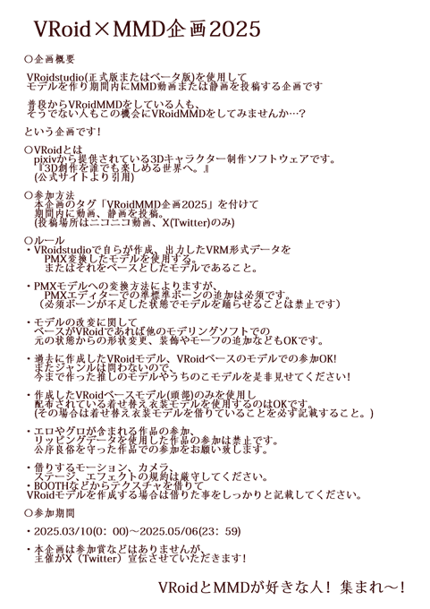

# 質問
添付画像の文字を読み取ってテキストに変換してください 

# 回答（Google Gemini)
はい、添付画像の文字をテキストに変換します。

---

VRoid × MMD 企画 2025

○企画概要

VRoidstudio(正式版またはベータ版)を使用して
モデルを作り期間内にMMD動画または静画を投稿する企画です
普段からVRoidMMDをしている人も、
そうでない人もこの機会にVRoidMMDをしてみませんか…?
という企画です!

○VRoidとは
pixivから提供されている3Dキャラクター制作ソフトウェアです。
「3D創作を誰でも楽しめる世界へ。」
(公式サイトより引用)

○参加方法
本企画のタグ「VRoidMMD企画2025」を付けて
期間内に動画、静画を投稿。
(投稿場所はニコニコ動画、X(Twitter)のみ)

○ルール
・VRoidstudioで自らが作成、出力したVRM形式データを
PMX変換したモデルを使用する。
またはそれをベースとしたモデルであること。

・PMXモデルへの変換方法によりますが、
PMXエディターでの準標準ボーンの追加は必須です。
(必須ボーンが不足した状態でモデルを踊らせることは禁止です)

・モデルの改変に関して
ベースがVRoidであれば他のモデリングソフトでの
元の状態からの形状変更、装飾やモーフの追加などもOKです。

・過去に作成したVRoidモデル、VRoidベースのモデルでの参加OK!
またジャンルは問わないので、
今まで作った推しのモデルやうちのこモデルを是非見せてください!

・作成したVRoidベースモデル(頭部)のみを使用し
配布されている着せ替え衣装モデルを使用するのはOKです。
(その場合は着せ替え衣装モデルを借りていることを必ず記載すること。)

・エロやグロが含まれる作品の参加、
リッピングデータを使用した作品の参加は禁止です。
公序良俗を守った作品での参加をお願い致します。

・借りるモーション、カメラ、
ステージ、エフェクトの規約は厳守してください。

・BOOTHなどからテクスチャを借りて
VRoidモデルを作成する場合は借りた事をしっかりと記載してください。

○参加期間

2025.03/10(0:00)～2025.05/06(23:59)

・本企画は参加賞などはありませんが、
主催がX(Twitter)宣伝させていただきます!

VRoidとMMDが好きな人! 集まれ～!
