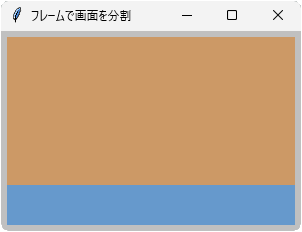

# tkinter.Frame
- ウィンドウを分割する枠組み用のクラス
- 他の GUI パーツを置く土台にするとよい

## サンプル


```python
import tkinter

root = tkinter.Tk()
root.title('フレームで画面を分割')
root.geometry('300x200+100+20')
root.minsize(250, 150)
root.config(bg='#c0c0c0', padx=6, pady=6)

frame_a = tkinter.Frame(root, bg='#cc9966', width=80, height=80)
frame_a.pack(side='top', expand=True, fill='both')

frame_b = tkinter.Frame(root, bg='#6699cc', width=40, height=40)
frame_b.pack(side='top', expand=False, fill='x')

root.mainloop()
```

- コンストラクタ `Frame()` で親ウィンドウを指定する
- 親ウィンドウに配置するには `pack()` メソッドがオススメ
- `pack()` メソッドの引数 `side`、`expand`、`fill` で、いろいろな分割が可能
- 上記の例では、上部=高さ可変、下部=高さ固定になる

## メソッド一覧
- メソッド一覧はこちら＞ [TkDocs / Frame](https://tkdocs.com/pyref/frame.html)

## コンストラクタ
- 第1引数で親ウィンドウを指定する

	例： `frame = tkinter.Frame(parent)`

- 第2引数以降で、config() の項目も設定できる

	例： `frame = tkinter.Frame(parent, bg='#cc9966')`

## config メソッド
- **config(項目名1=設定値1, ...)**
<!-- -->
+ Frame クラスのおもな設定項目

	| 項目名 | 意味 | デフォルト値 |
	|---|---|---|
	| background| 背景色 ( **bg** も可)| "SystemWindowText" |
	|width|幅|（ピクセル単位）|
	|height|高さ（ピクセル単位）|
	|bd|枠線の太さ（ピクセル単位）|
	|relief|枠線タイプ（flat, groove, raised, ridge, solid, sunken）
	|padx|左右のパディング（ピクセル単位）|
	|pady|上下のパディング（ピクセル単位）|

- 引数は「**名前付き引数 = 値**」形式

	例： `frame.config(bg="#ccc")`

- 引数なしで呼び出すと、すべての設定を辞書形式で返す

## cget メソッド
- **cget(項目名)**
- `config()` の項目名を文字列で渡すと、その現在の値を返す
- すべての項目名を得るには、`config().keys()` を列挙する

	例： `for i in frame.config().keys(): print(i, ":", frame.cget(i))`

### pack(side=＊, expand=＊, fill=＊)
- フレームを積み重ねるイメージで配置する
- それぞれの引数の意味を次に示す

---
|side|意味|
|---|---|
|top|上辺に向けてフレームを積む|
|bottom|下辺に向けてフレームを積む|
|left|左辺に向けてフレームを積む|
|right|右辺に向けてフレームを積む|

- `side` 引数はフレームを積む方向を決める
- 異なる `side` を混在させてもよいが、すべて統一するとわかりやすい

---
|expand|意味|
|---|---|
|False|フレーム同士を密着させる|
|True|フレームをまばらに配置する|

- `expand` 引数はフレーム間の空白を指定する。
- `expand=True` のフレームがいくつもある場合、空白は均等割りされる。

---
|fill|意味|
|---|---|
|"none"|なにもしない|
|"x"|横いっぱいに広げる|
|"y"|縦いっぱいに広げる|
|"both"|縦横いっぱいに広げる|

- `fill` 引数は、`expand` で広げた空地を埋めるかどうかを決める。
- `fill="none"` にすると、`side` や `expand` の効果がわかりやすいので実験してみよう！
