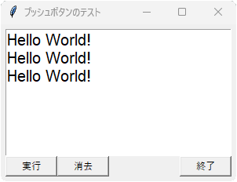

# tkinter.Button
- プッシュボタン

## サンプル


```python
import tkinter

# メインウィンドウを作成
root = tkinter.Tk()
root.title('プッシュボタンのテスト')
root.geometry('300x200+100+20')
root.config(padx=6, pady=6)

# ウィンドウ上部にテキストボックスを配置
textbox = tkinter.Text(root, font=('Arial', 15), height=1)
textbox.pack(side='top', expand=True, fill='both')

# ウィンドウ下部にフレームを配置
frame = tkinter.Frame(root)
frame.pack(side='top', expand=False, fill='x')

# 「Hello World!」と表示する関数を定義
def hello():
    textbox.insert('end', 'Hello World!\n')
    textbox.see('end')

# テキストをクリアする関数を定義
def clear():
    textbox.delete('1.0', 'end')

# 下部フレームに左詰めで「実行」ボタンを配置
btn_work = tkinter.Button(frame, text='実行', width=8, command=hello)
btn_work.pack(side='left')

# 下部フレームに左詰めで「消去」ボタンを配置
btn_clear = tkinter.Button(frame, text='消去', width=8, command=clear)
btn_clear.pack(side='left')

# 下部フレームに右詰めで「終了」ボタンを配置
btn_quit= tkinter.Button(frame, text='終了', width=8, command=root.quit)
btn_quit.pack(side='right')

# ウィンドウのGUI処理を開始
root.mainloop()
```

- ボタンを横に並べるには、横長のフレームに `pack(side="left")` するとよい
- 一部のボタンを ``pack(side="right")` にしてもよい
- 上の例では、「実行」と「消去」を左に、「終了」を右に配置している
- ボタンを押したときの処理は、`config(command=関数名)` で指定する
- 関数として、任意の引数なし関数が指定できる

## メソッド一覧
- メソッド一覧はこちら＞ [TkDocs / Button](https://tkdocs.com/pyref/button.html)

## コンストラクタ
- 第1引数で親ウィンドウを指定する

	例： `button = tkinter.Button(parent)`

- 第2引数以降で、config() の項目も設定できる

	例： `button = tkinter.Button(parent, width=8, text="実行")`

## config メソッド
- **config(項目名1=設定値1, ...)**
<!-- -->
+ Button クラスのおもな設定項目

	| 項目名 | 意味 | デフォルト値 |
	|---|---|---|
	|foreground| 文字色 ( **fg** も可)| "SystemButtonText" |
	|background| 背景色 ( **bg** も可)| "SystemButtonFace" |
	|width|幅| 1（ピクセル単位）|
	|text|ボタンの文字|""|

- 引数は「**名前付き引数 = 値**」形式

	例： `button.config(text="実行")`

- 引数なしで呼び出すと、すべての設定を辞書形式で返す

## cget メソッド
- **cget(項目名)**
- `config()` の項目名を文字列で渡すと、その現在の値を返す
- すべての項目名を得るには、`config().keys()` を列挙する

	例： `for i in frame.config().keys(): print(i, ":", frame.cget(i))`

